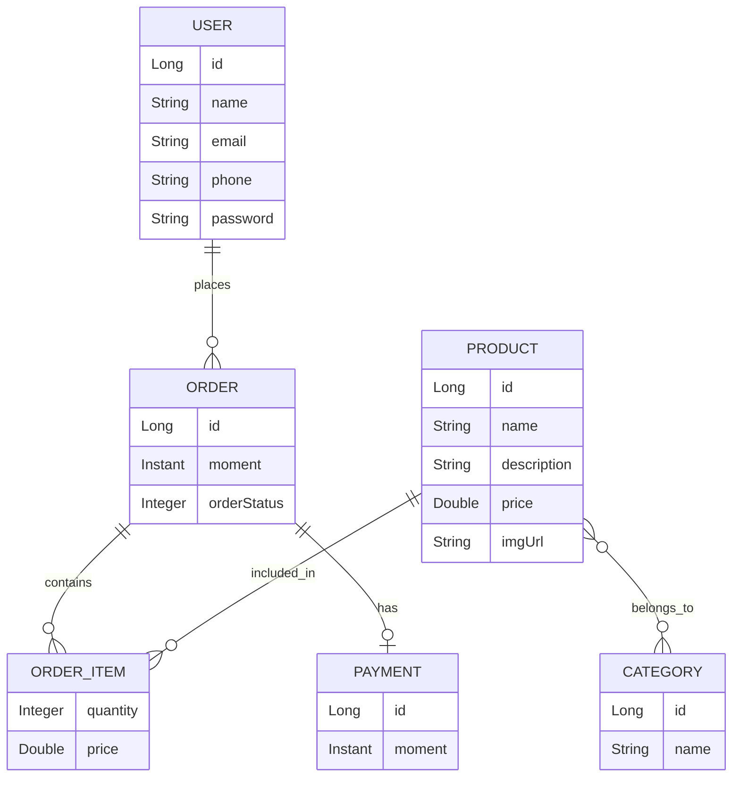

# Mtech API


## Sobre o projeto

A **Mtech API** é uma API REST desenvolvida com Java e Spring Boot, estruturada em camadas e utilizando JPA/Hibernate para persistência de dados relacionais.

O projeto foi desenvolvido para consolidar conceitos de desenvolvimento Backend com Java e Spring Boot, incluindo:

* API REST;
* arquitetura em camadas;
* operações CRUD;
* persistência com JPA/Hibernate;
* relacionamentos entre entidades;
* banco de dados relacional;
* tratamento centralizado de exceções;
* utilização dos métodos HTTP.

A aplicação possui recursos para consulta de usuários, produtos, pedidos e categorias, além das operações de criação, atualização e exclusão de usuários.

## Tecnologias

| Tecnologia        | Utilização                                         |
| ----------------- | -------------------------------------------------- |
| Java 23           | Linguagem de programação                           |
| Spring Boot 4.1.0 | Framework principal                                |
| Spring Web MVC    | Desenvolvimento da API REST                        |
| Spring Data JPA   | Abstração de persistência                          |
| Hibernate/JPA     | Mapeamento objeto-relacional                       |
| Maven             | Gerenciamento do projeto e dependências            |
| H2                | Banco utilizado no profile `test` atualmente ativo |
| PostgreSQL        | Driver disponível como dependência                 |

A versão do Java e as dependências utilizadas estão definidas no `pom.xml`.

## Arquitetura

A aplicação segue uma arquitetura em camadas, separando responsabilidades entre recursos HTTP, regras de aplicação e persistência.

```text
                    HTTP Request
                         │
                         ▼
              ┌────────────────────┐
              │ Resources          │
              │ Controllers REST   │
              └─────────┬──────────┘
                        │
                        ▼
              ┌────────────────────┐
              │ Services           │
              │ Regras de negócio  │
              └─────────┬──────────┘
                        │
                        ▼
              ┌────────────────────┐
              │ Repositories       │
              │ Spring Data JPA    │
              └─────────┬──────────┘
                        │
                        ▼
                  ┌───────────┐
                  │ Database  │
                  └───────────┘
```

### `entities`

Contém as entidades persistidas pela aplicação e seus respectivos mapeamentos JPA.

São utilizadas as entidades:

* `User`
* `Order`
* `OrderItem`
* `OrderItemPK`
* `Product`
* `Category`
* `Payment`
* `OrderStatus`

### `repositories`

Contém as interfaces de acesso aos dados utilizando Spring Data JPA.

Existem repositories para:

* `User`
* `Order`
* `OrderItem`
* `Product`
* `Category`

### `services`

Camada responsável por intermediar as operações entre os Resources e os Repositories.

Atualmente existem:

* `UserService`
* `ProductService`
* `OrderrService`
* `CategoryService`

O `UserService` também concentra as operações de inserção, atualização e exclusão de usuários, incluindo o tratamento de situações relacionadas à ausência do recurso e à integridade do banco.

### `resources`

Contém os controllers REST responsáveis por receber as requisições HTTP e delegar as operações aos Services.

Resources disponíveis:

* `UserResource`
* `ProductResource`
* `OrderResource`
* `CategoryResource`

### `resources.exceptions`

Contém o tratamento centralizado das exceções da camada HTTP.

`ResourceExceptionHandler` utiliza `@ControllerAdvice` para converter exceções específicas da aplicação em respostas HTTP padronizadas.

### `services.exceptions`

Contém as exceções customizadas utilizadas pela camada de serviço:

* `ResourceNotFoundException`
* `DataBaseException`

### `config`

Contém a configuração utilizada para inicialização dos dados do ambiente de teste.

`TesteConfig` implementa `CommandLineRunner` e popula o banco H2 com usuários, pedidos, categorias, produtos, itens de pedido e pagamento quando o profile `test` está ativo.

## Modelo de domínio

O modelo de domínio é baseado em usuários, pedidos, produtos e categorias.



### Relacionamentos

**User → Order**

* Um `User` pode possuir vários `Order`.
* Cada `Order` pertence a um `User`.
* Mapeamento: `@OneToMany` / `@ManyToOne`.

**Order → OrderItem**

* Um `Order` pode possuir vários `OrderItem`.
* Cada `OrderItem` está associado a um `Order`.
* A associação utiliza `OrderItemPK` como chave composta.
* Mapeamento: `@OneToMany` no `Order`.

**Product → OrderItem**

* Um `Product` pode aparecer em vários `OrderItem`.
* Cada `OrderItem` referencia um `Product`.
* A relação é implementada através de `OrderItemPK`.

**Order ↔ Product**

`OrderItem` funciona como entidade associativa entre `Order` e `Product`, permitindo armazenar informações específicas da associação, como:

* quantidade;
* preço do produto no item do pedido.

Dessa forma, o modelo representa uma relação muitos-para-muitos entre pedidos e produtos por meio de uma entidade intermediária.

**Product ↔ Category**

* Um `Product` pode possuir várias `Category`.
* Uma `Category` pode possuir vários `Product`.
* Mapeamento: `@ManyToMany`.
* A associação utiliza a tabela `tb_product_category`.

**Order → Payment**

* Um `Order` pode possuir um `Payment`.
* Um `Payment` pertence a um `Order`.
* Mapeamento: `@OneToOne`.
* O `Payment` utiliza `@MapsId`, compartilhando o identificador do pedido.

**OrderStatus**

`OrderStatus` é um `enum` utilizado para representar o estado do pedido.

Estados definidos atualmente:

* `WAITING_PAYMENT`
* `PAID`
* `SHIPPED`
* `DELIVERED`
* `CANCELED`

## Endpoints

### Users

| Método   | Rota          | Descrição                     | Status           |
| -------- | ------------- | ----------------------------- | ---------------- |
| `GET`    | `/users`      | Retorna todos os usuários     | `200 OK`         |
| `GET`    | `/users/{id}` | Retorna um usuário pelo ID    | `200 OK`         |
| `POST`   | `/users`      | Cria um novo usuário          | `201 Created`    |
| `PUT`    | `/users/{id}` | Atualiza um usuário existente | `200 OK`         |
| `DELETE` | `/users/{id}` | Remove um usuário pelo ID     | `204 No Content` |

O `POST /users` também retorna no header `Location` a URI do recurso criado.

### Products

| Método | Rota             | Descrição                  | Status   |
| ------ | ---------------- | -------------------------- | -------- |
| `GET`  | `/products`      | Retorna todos os produtos  | `200 OK` |
| `GET`  | `/products/{id}` | Retorna um produto pelo ID | `200 OK` |

### Orders

| Método | Rota           | Descrição                 | Status   |
| ------ | -------------- | ------------------------- | -------- |
| `GET`  | `/orders`      | Retorna todos os pedidos  | `200 OK` |
| `GET`  | `/orders/{id}` | Retorna um pedido pelo ID | `200 OK` |

### Categories

| Método | Rota               | Descrição                     | Status   |
| ------ | ------------------ | ----------------------------- | -------- |
| `GET`  | `/categories`      | Retorna todas as categorias   | `200 OK` |
| `GET`  | `/categories/{id}` | Retorna uma categoria pelo ID | `200 OK` |

Atualmente, operações `POST`, `PUT` e `DELETE` não estão implementadas para `Products`, `Orders` ou `Categories`.

## Tratamento de exceções

O tratamento de exceções é centralizado através de `ResourceExceptionHandler`, utilizando `@ControllerAdvice`.

As respostas seguem o modelo `StandardError`, que contém:

* `timestamp`
* `status`
* `error`
* `message`
* `path`

### Exceções tratadas

| Exceção                     |              HTTP | Situação                                                             |
| --------------------------- | ----------------: | -------------------------------------------------------------------- |
| `ResourceNotFoundException` |   `404 NOT FOUND` | Recurso não encontrado                                               |
| `DataBaseException`         | `400 BAD REQUEST` | Erro relacionado à integridade do banco durante operação de exclusão |

No `UserService`, `ResourceNotFoundException` é utilizada para operações de busca e para impedir a exclusão de um usuário inexistente.

`DataBaseException` é lançada quando uma `DataIntegrityViolationException` ocorre durante a exclusão de um usuário.

## Persistência

A aplicação utiliza **Spring Data JPA** e **Hibernate** para o mapeamento entre objetos Java e o banco de dados relacional.

O profile ativo atualmente é:

```properties
spring.profiles.active=test
```

Nesse profile, a aplicação está configurada para utilizar um banco **H2 em memória**:

```properties
spring.datasource.driverClassName=org.h2.Driver
spring.datasource.url=jdbc:h2:mem:testdb
```

A aplicação também disponibiliza o console do H2 em:

```text
/h2-console
```

O projeto possui o driver do PostgreSQL como dependência, porém o profile atualmente ativo não configura uma conexão PostgreSQL. Portanto, o PostgreSQL **não deve ser considerado o banco atualmente utilizado pela aplicação**.

A configuração atual também habilita a inicialização de dados pelo `TesteConfig`, que popula o banco H2 com dados de exemplo durante a inicialização do profile `test`.

## Como executar

### Pré-requisitos

* Java 23
* Git

O projeto possui Maven Wrapper, portanto não é necessário instalar o Maven separadamente.

### Clone do projeto

```bash
git clone https://github.com/Monteirix/minha-primeira-spring-api.git
cd minha-primeira-spring-api
```

### Windows

```powershell
.\mvnw.cmd spring-boot:run
```

### Linux/macOS

```bash
./mvnw spring-boot:run
```

Após a inicialização, a aplicação estará disponível em:

```text
http://localhost:8080
```

O profile `test` é ativado pela configuração principal da aplicação, fazendo com que o H2 em memória seja utilizado durante a execução.

## Próximos passos

As funcionalidades abaixo **não fazem parte da implementação atual** e representam possíveis evoluções do projeto:

* [ ] Configuração efetiva do PostgreSQL
* [ ] Testes automatizados
* [ ] Documentação da API com Swagger/OpenAPI
* [ ] Containerização com Docker
* [ ] Deploy da aplicação

## Autor

**Matheus Monteiro**

Estudante de Análise e Desenvolvimento de Sistemas com foco em desenvolvimento Backend utilizando Java e Spring Boot.

* LinkedIn: `https://www.linkedin.com/in/matheus-monteiro-5033a923b`
* GitHub: `https://github.com/Monteirix`
